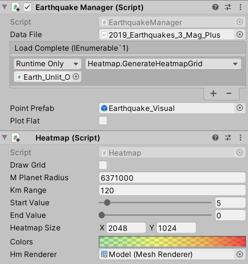

# Global Coordinate Mapper

The Global Coordinate Mapper is a free, open source project for visualizing data sets across a globe in Unity. It gives you the flexibility to visualize data without having to set up custom models or adhere to specific json schemas, but the power to add any customization you need!

Global Coordinate Mapper will do the spherical UV mapping for you, so no need for custom planet models or meshes.

## Installation

Please download and install Global Coordinate Mapper from the Unity Asset Store: {Add link once available}

//TODO: This project requires Json.Net for Unity

## How to Use

**Note**: In order to use any of the Global Coordinate Mapper scripts in code you must include the namespace by adding `using CoordinateMapper` to the top of your script.

### Initial Setup
All you need to get started with visualizing data is a Json or Csv dataset which contains keys for latitude and longitude.

**Add a planet:** 
To add a planet just right click on the scene hierarchy and choose `Planet` or use the `Coordinate Mapper > Create Planet` menu item. There are 4 preset options:
+ **Lit Planet:** Standard planet that respects lighting within the scene
+ **Unlit Planet:** Same as Lit but ignores lighting within the scene
+ **Lit Overlay Planet:** Planet that contains 2 textures, one for the planet texture itself, and another that gets overlaid using the alpha (Used for heatmaps) and respects lighting within the scene
+ **Unlit Overlay Planet:** Same as Lit Overlay, but ignored lighting within the scene

**Note:** In order for the the plotting to work properly, you must add a `Planet` layer to your project, and set the created planet to use that layer. You can add a layer by going to `Edit > Project Settings > Tags and Layers`.

#### Visualization Options
Coordinate Mapper provides two different paths to visualizing data. A default visualizer and a custom visualizer. The default implementation is for users who just want to see their data visualized and don't need to adjust or add anything to the process. In order to use the default visualization all you need is data that contains latitude and longitude keys formatted in accordance with any of the supported formats (Outline in *KeyFormat* below)

#### Default Visualization

**Add the visualizer script**:
Once you have your planet setup, select it in the scene view and add the `Default Visualizer` script. This script will take a data set, parse it, and plot the points using the default implementations provided with the framework. It supports a number of different data schemas outlined below.

**Properties:**
*Data File:* The file to parse containing the coordinate data
*Point Prefab:* The model that gets plotted on to the planet (There are a couple that come with the framework inside the *Prefabs* folder)
*Key Format:* How the latitude and longitude keys are stored within the data set:
* Json Lat and Lng Keys - json dataset has separate latitude and longitude keys for each location
* Json Single Lat Lng Array - json dataset for each location is an array of alternating latitude and longitude values
* Json Lat Lng Array - json dataset for locations has an array containing values for latitude and a separate array containing keys for longitude
* Csv - Csv dataset, must contain column for latitude and separate column for longitude

*Latitude Key:* The key within the dataset containing the latitude values
*Longitude Key:* The key within the dataset containing the longitude values

The default visualizer also supports an **optional** magnitude key, which will scale the Z value of the point prefab for the location by the magnitude value. (See Earthquake Demo)
*Magnitude Key:* The key within the dataset containing the magnitude values

*Load Complete:* An event that can be used to pass along the plotted points if any other script wants access to them

Just fill out the appropriate properties and press play! You should see your data mapped to the planet!

#### Custom Visualization
While the default visualizer is great to get something displaying quickly, it is purposefully limited in it's use. If you require any extra keys other than *Latitude*, *Longitude*, and *Magnitude* or if you want to customize the way GameObjects get mapped on to the planet, etc..., you will need to take the customized approach.

The custom approach can really be broken out in to two processes: Parsing your data, and plotting your data.

#### Parsing your Data

**IDataLoader**
Extend this interface on any custom scripts you need to parse your data sets. This is useful if you need to parse out more values than the default visualizer allows (*Latitude*, *Longitude*, and *Magnitude*).
IDataLoader ensures your class has the following:
- *TextAsset dataFile:* The file containing your data, should be json or csv format
- *void ParseFile(string fileText):* Should be used to take in the string representation of the data set and parse out and serialize any values needed
- *DataLoadedEvent loadComplete:* A unity event for passing along the plotted coordinate points. If needed, will most likely be called at the end of the `ParseFile` function

Scripts implementing this protocol should accept a file (*dataFile*) that you send to the appropriate parser through *ParseFile*, which returns the necessary info to create your *ICoordinatePoint* objects and send them along (using *loadComplete*) to any scripts that care.

**Parsers**

There are two parsers: JsonParser and CsvParser that take their respective file types.

The `JsonParser` *Parse* functions accepts:
- *string json* - The text from the file
- *string[] keys* - The keys to parse out of the json text
Returns a `Dictionary<string, object[]>` where each key sent along to the function is used as the key for the parsed values object[].

```c#
var jsonParsed = JsonParser.Parse(fileText, new string[] { "latitude", "longitude", "magnitude", "place", "time" });
```

The `CsvParser` *Parse* function accepts:
- *string text* - The text from the file
Returns a `Dictionary<string, object[]>` where the names for each column are used as the keys for the parsed values object[].

**Note:** The dictionary values are returned as an `object[]`. So it is up to you to convert them to the proper type. For example, if you were dealing with your longitude values, and they are floats in your data set, you might cast them like so:

```c#
var lngs = jsonParsed["longitude"].Select(m => Convert.ToSingle(m)).ToArray();
```

Once you have everything properly parsed and casted, you can use that to create and plot **ICoordinatePoint**s

**ICoordinatePoint**
Extend this interface on the actual script that represents what should get plotted on to the planet.
ICoordinatePoint ensures your class has the following:
- *Location location:* See below
- *GameObject pointPrefab:* The model that gets plotted on to the planet
- *GameObject Plot(Transform planet, Transform container, int layer):* Should be used to plot the prefab itself, and then perform an custom manipulation needed on it (such as scaling):
    - *planet:* The transform of the gameobject the point prefab should map to
    - *container:* The transform of the gameobject to add as a parent of the plotted point prefab
    - *layer:* The layer from *Tags and Layers* to use for the plotted point prefab
    
The main point of this protocol is to call the `Plot(Transform planet, Transform container, int layer)` function and handle the placement of the point to the planet. Typically, you will start by calling `public static GameObject PlacePoint(Transform planet, Transform container, Location location, GameObject prefab)` (Outlined below), which returns the plotted GameObject. Once you have the GameObject, you can make any adjustments you need. Here is an example from the Earthquake Demo:

```c#
public GameObject Plot(Transform planet, Transform container, int layer) {
    var plotted = PlanetUtility.PlacePoint(planet, container, location, pointPrefab); //Plot the point

    if (plotted != null) {
        plotted.layer = layer; //Set the layer

        //Add a Monobehaviour and store this class on it
        var eqPoint = plotted.AddComponent<EarthquakePoint>(); 
        eqPoint.info = this;

        //Adjust the scaling as a function of magnitude
        plotted.transform.localScale = new Vector3(plotted.transform.localScale.x, plotted.transform.localScale.y, plotted.transform.localScale.z * Mathf.Pow(2f, magnitude));

        //Orient the point to the surface of the planet at this location
        var point = (plotted.transform.position - planet.transform.position).normalized;
        plotted.transform.rotation = Quaternion.LookRotation(point);
    }

    return plotted;
}
```

**Heatmap**
Can be added to the planet gameobject in order to visualize the data as a heatmap. Contains the following properties:
- *M Planet Radius:* This is the planet's **radius** (not diameter) in meters (i.e. - The Earth is 6371000)
- *Km Range:* The range, in kilometers, each points of data should effect on the heatmap
- *Start Value:* The value (between 0 and 100) that is added to the heatmap at the location of the data point
- *End Value:* As we get farther from the location of the data point (up to the *Km Range*), the amount of point effects the location diminishes. *End Value* is how much effect should be added to the heatmap at the limit of *Km Range*. Should be less than *Start Value*.
- *Heatmap Size:* The size of the heatmap texture (in pixels) to use. (Keep in mind, the larger the texture, the more processing intesive the heatmap)
- *Colors:* The color gradient used to draw the heatmap (Gradient location 0 corresponds to heatmap value 0 and so on to gradient location 100).
- *Hm Renderer:* The gameobject containing the Mesh Renderer with the proper *Overlay* material (described above)

There are two steps to generating a heatmap:
- Ensure you have a material on your planet that accepts can accept and display a secondary texture. There are a number of premade materials for this located at `Coordinate_Mapping > Materials`, they have *Overlay* appended to the name. Also, the Overlay versions of the planets from the *Add a planet* section outlined above come setup to accept a heatmap.
- Call ```public async void GenerateHeatmapGrid(IEnumerable<ICoordinatePoint> points)```. This accepts a list of *ICoordinatePoint*s, generates a heatmap texture from them, and supplies it to the material as the overlay texture (using the property reference name *_OverlayTex*.

The typical path for generating a heatmap would be to add the `Heatmap` script to your GameObject, then add the `GenerateHeatmapGrid` function as an event listener for your `IDataLoader`'s `loadComplete` event (Which sends along a list of `ICoordinatePoint`s). Here is an example from the Earthquake demo:



## Extras

TODO: Importing Textures: settings for textures

//TODO: Creating your own point prefab

## Demos

TODO